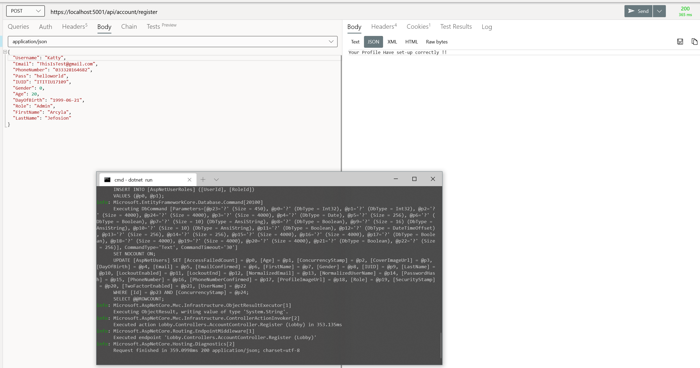
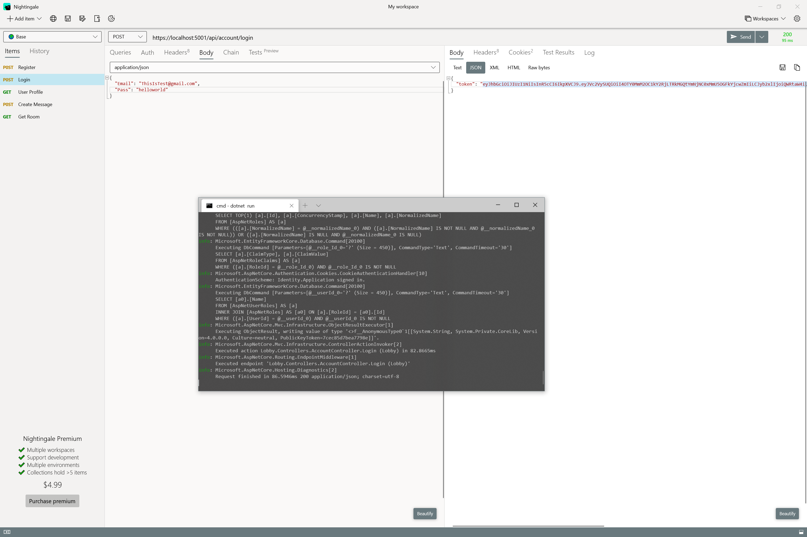
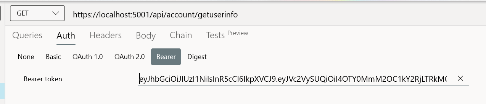
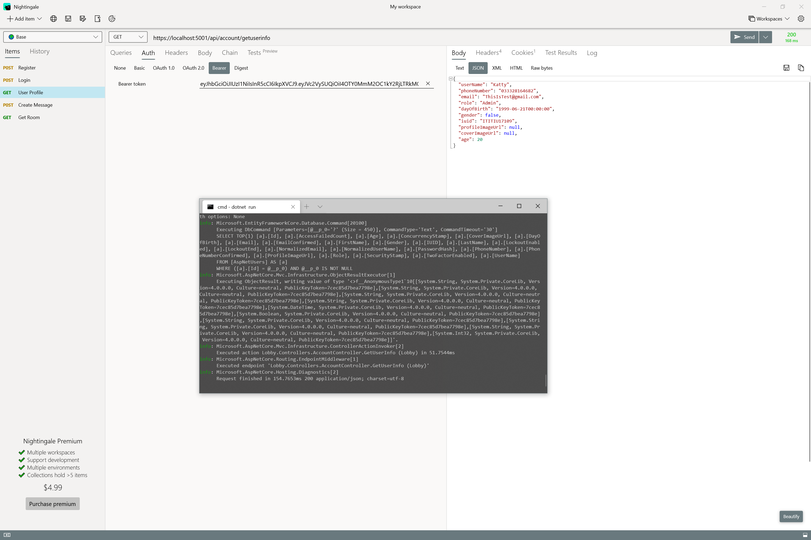
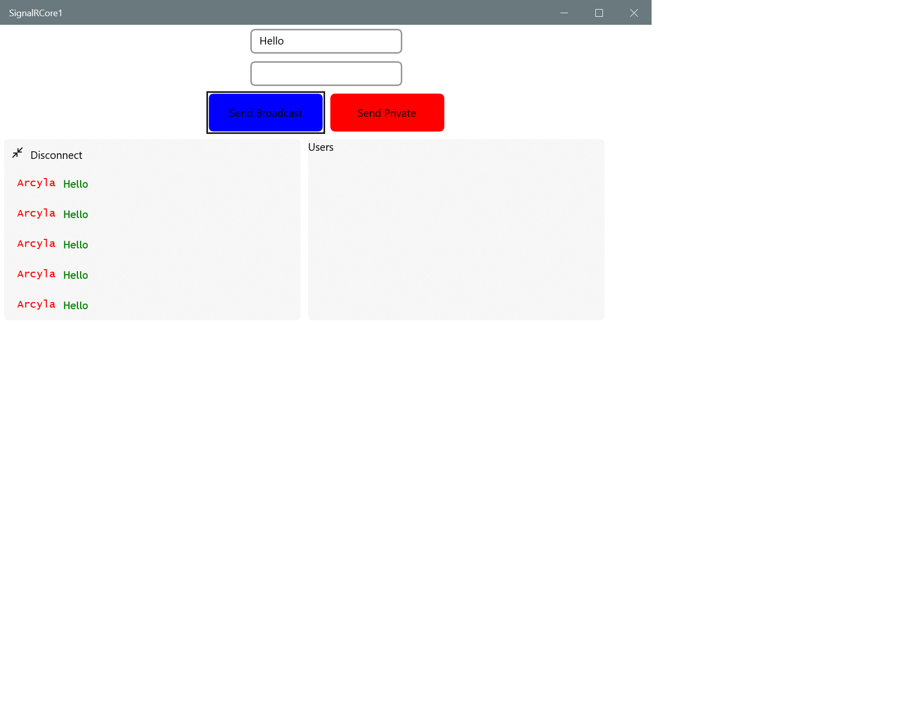

# ASP.NET Web API
* ASP.NET CORE (Version 3.1.0)
* HTTPS (CRUD Operations)
* JWT (Authentication and Security with JWT)
* Entity Framework Core (ORM SQL Database)
* SignalR Core (Real Time Application with support Authentication)

This is the Project design to run in the server. Use this for:
* Store data
* Handle call request over HTTPS
* Sign in and Sign up with JWT
* And authenticate with JWT
* Real time chat with SignalR 

 ---------------
Demo with Nightingale:
* Start-up .NET Core

* Sign-up

* Sign-in

You will get the token and later this token will be used to do anything
* Input Token

* Get User Info

* Get All The Rooms

 ------------------
# SignalR
* Connect

* IU (UWP separate project)

